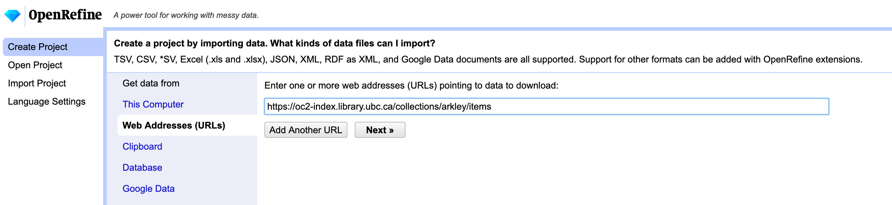
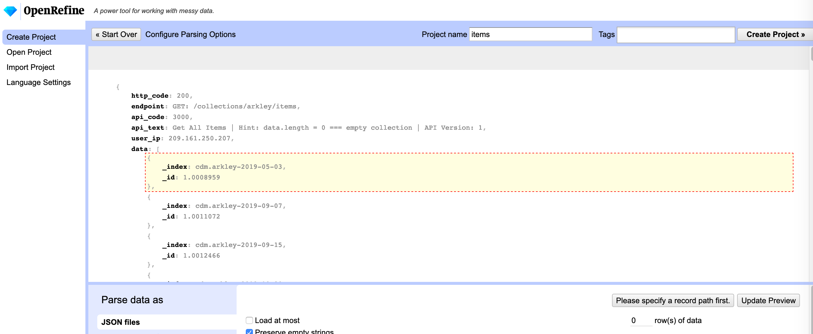
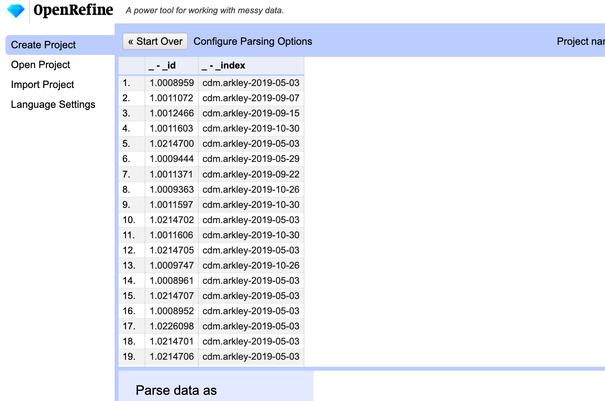
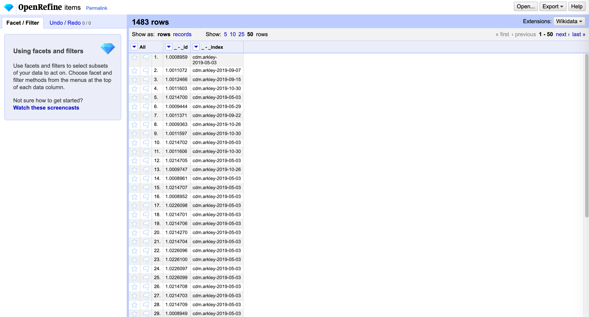
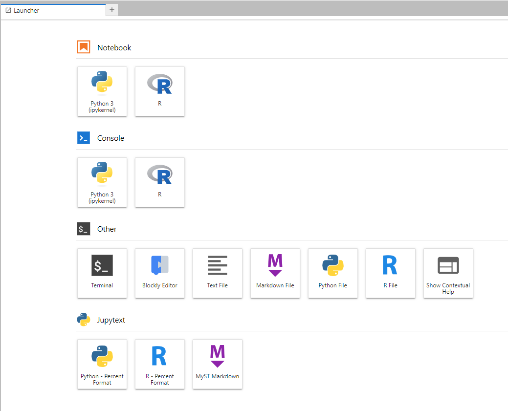
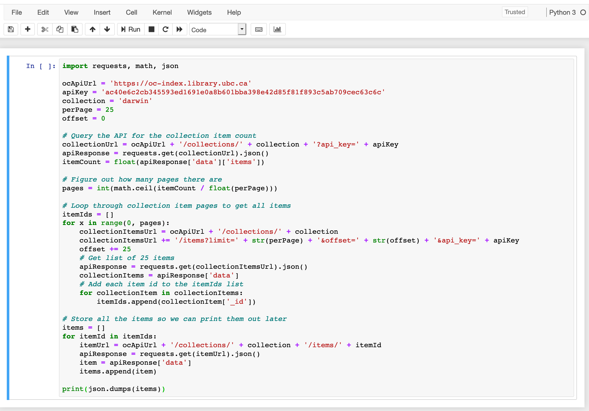
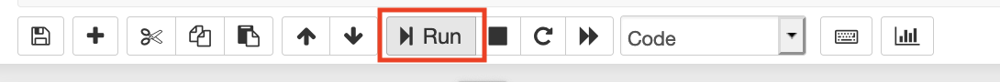
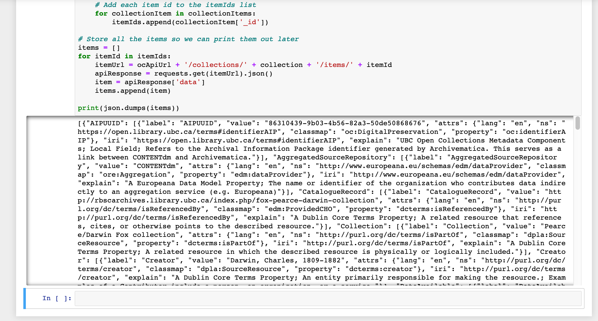
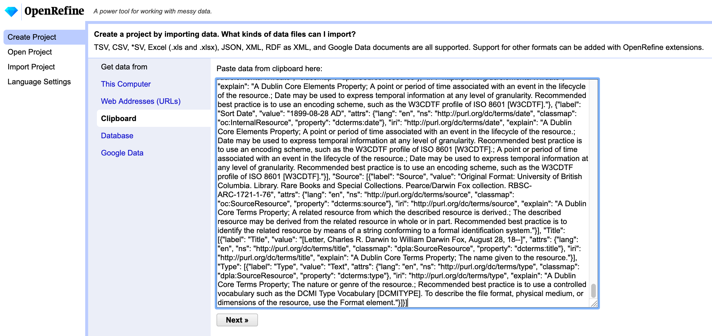
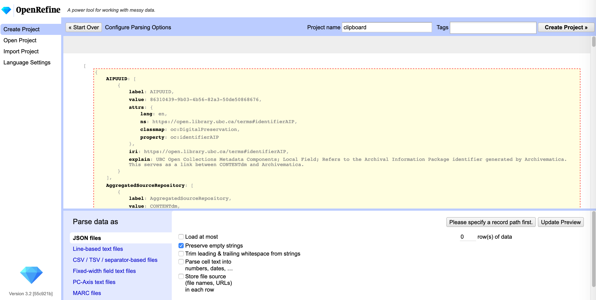

<em><a href="../slides/getting-started.html" target="_blank">View slides</a> for this section</em>

# Calling an API with a script
The examples we have touched on so far are fairly simple. Often when working with APIs we want to be able to get targeted information quickly and the most effective way to do this is through the use of additional tools like a script.

## Querying the Open Collections API
The UBC Library's [Open Collections](https://open.library.ubc.ca/) has a open API which anyone can use though you do need to register an email address in order to make large or more involved requests.

Detailed documentation about the API is [available here](https://open.library.ubc.ca/docs).

### 2.1 Through OpenRefine
A quick and easy way to get data from an API endpoint is through the "Web Addresses (URLs)" function in OpenRefine. All you need to make use of this is a well structured query with the parameters that you want to get.

We will be using a common example in the UBC Library Open Collections documentation: [https://oc2-index.library.ubc.ca/collections/darwin/items](https://oc2-index.library.ubc.ca/collections/darwin/items). This query returns a list of all of the items in the Darwin collection.

1. First try pasting the query into a browser window to see whether any errors come up. This is a quick and easy way to check that your query is well structured.

2. Open OpenRefine and paste your query string into the "Web Addresses (URLs)" option under "Get data from".

3. OpenRefine will ask you to identify what you want out of the data.

After doing this you should see a preview that is a bit more readable.

4. Select "Create Project" which processes the rest of the data and transforms the JSON into a tabular format. To view more records select "show 50" and you will end up with something like this:  

From here you can keep working in OpenRefine or export the data.

### 2.2 Through a Python script

For this activity we will be working in [UBC Syzygy](https://ubc.syzygy.ca/). Syzygy is a collection of research tools that are accessible through a web browser. One of these tools is "Jupyter" which is an electronic notebook that lets you run scripts in common programming languages and see the output immediately with no additional installation or setup required.

We are also going to follow the instructions in the [Open Collections documentation](https://github.com/ubc-library/docs-open-collections-api/blob/master/scripts/all_items_from_a_collection/all_items_from_a_collection.py). You do not need to read the full documentation to complete this activity but we encourage you to explore it if you are interested in learning more about what's possible with the Open Collections API.

1. Please log in to [UBC Syzygy here](https://ubc.syzygy.ca/). Click on the red house and log in via UBC CWL.

2. Select Python 3 under Notebook.

3. The Open Collections documentation has several open scripts for you to experiment with. We will be using the Python version of the script that retrieves a list of all of the items in a collection and their metadata (descriptive information about them). The script is included below but you can also take a look at it in [Github here](https://github.com/ubc-library/docs-open-collections-api/blob/master/scripts/all_items_from_a_collection/all_items_from_a_collection.py).

This script was originally written by Sean McNamara @Seanmcn for the UBC Library and updated by Schuyler Lindberg.

~~~ python
import requests, math, json

ocApiUrl = 'https://oc-index.library.ubc.ca'
apiKey = '' # your api key here between the quotes
collection = 'florence'
perPage = 25
offset = 0

# Query the API for the collection item count
collectionUrl = ocApiUrl + '/collections/' + collection + '?api_key=' + apiKey
apiResponse = requests.get(collectionUrl).json()
itemCount = float(apiResponse['data']['items'])
print(itemCount)

# Figure out how many pages there are
pages = int(math.ceil(itemCount / float(perPage)))
print(pages)

# Loop through collection item pages to get all items
itemIds = []
for x in range(0, pages):
    collectionItemsUrl = ocApiUrl + '/collections/' + collection
    collectionItemsUrl += '/items?limit=' + str(perPage) + '&offset=' + str(offset) + '&api_key=' + apiKey
    offset += 25
    print(collectionItemsUrl)
    # Get list of 25 items
    apiResponse = requests.get(collectionItemsUrl).json()
    collectionItems = apiResponse['data']
    # print(collectionItems)
    # Add each item id to the itemIds list
    for collectionItem in collectionItems:
        itemIds.append(collectionItem['_id'])

# Store all the items so we can print them out later
items = []
for itemId in itemIds:
    itemUrl = ocApiUrl + '/collections/' + collection + '/items/' + itemId + '?api_key=' + apiKey
    apiResponse = requests.get(itemUrl).json()
    item = apiResponse['data']
    # print(itemUrl)
    # print(item)
    if item == 'null':
        print('NULL!!')

    items.append(item)

print(json.dumps(items))
~~~

4. Copy the script as it currently is and paste it into the dialog box in your new Jupyter notebook,

and run the script.

5. After a few moments you will see the output of your API call in the Jupyter notebook. At this stage your output is in JSON format.
. As a final step, let's turn this into tabular data through Open Refine.

6. Select all of our JSON output in the Jupyter notebook. A quick way to do this for a small amount of data is to select the beginning of our output, hold "Shift" and then select the end. CMD+C or CTRL+C to copy. Open OpenRefine and paste your copied output into the OpenRefine "clipboard" input.

After selecting "Next" OpenRefine will ask you to explain the data to it a bit. For this exercise you need to tell it where the data begins that you want to see in a tabular format.

From here you can keep working with the data in OpenRefine or you can export it into a more familiar format to work with in another tool such as Excel.
!(Export data](export-to-csv.png)
